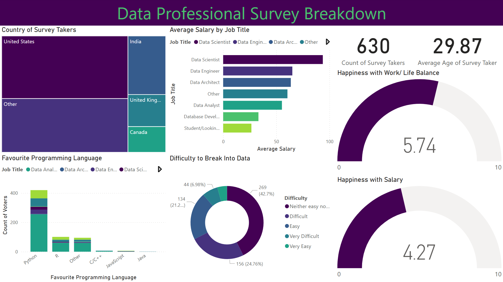

# Power-BI-Analysis
This project involved analysing and visualising survey data provided by data professionals, covering aspects such as location, salary, favourite programming language, and overall job satisfaction. The data was cleaned and transformed using Power Query, allowing for the handling of missing values, column formatting, and combining multiple data sources. Relationships and joins were established to connect tables effectively, and DAX formulas were applied to calculate key metrics such as average salary by region, language popularity, and satisfaction trends.

The project features an interactive Power BI dashboard with multiple visualisations, including bar charts, maps, and scatter plots. Drill-downs and grouping enable detailed exploration, while conditional formatting highlights trends and anomalies. Overall, this project demonstrates how structured data modelling, combined with interactive visual analytics, can uncover insights about the data profession and support informed decision-making.

## Dashboard

