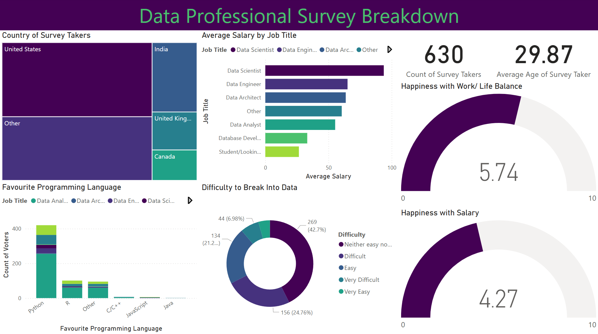

# Power-BI-Analysis
This Power BI project analysed and visualised, via an interactive dashboard, data given by data professionals, including location, salary, favourite programming language, and overall happiness.

It used Power Query for data transformation, joins and relationships for connections, DAX for calculations, and various visualisations with drill-downs, groups, and conditional formatting to uncover insights.

